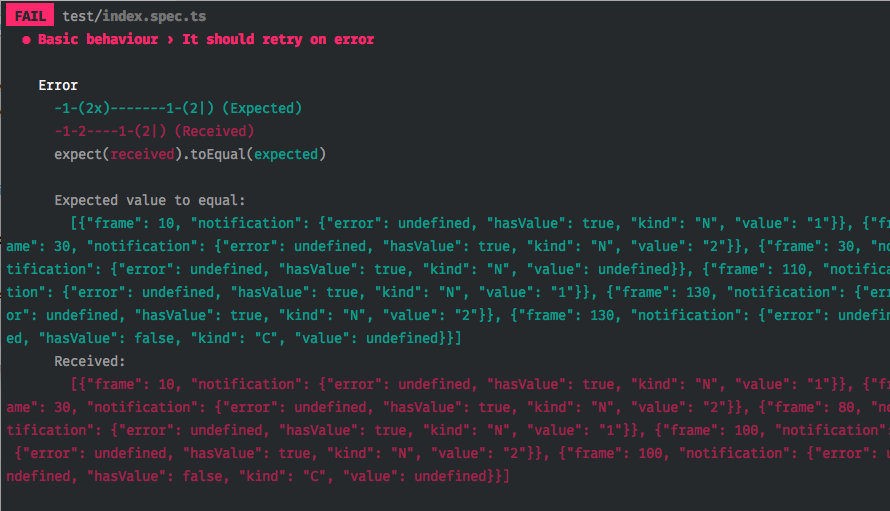

# rx-polling

[](https://www.npmjs.com/package/rx-polling) [](https://travis-ci.org/jiayihu/rx-polling)

**rx-polling** is a tiny (1KB gzipped) [RxJSv6](http://github.com/ReactiveX/RxJS)-based library to run polling requests on intervals, with support for:

- pause and resume if the browser tab is inactive/active
- N retry attempts if the request errors
- Different **backoff strategies** if the request errors:
  1. *exponential*: it will wait 2, 4, ... 64, 256 seconds between attempts. (Default)
  2. *random*: it will wait a random time amount between attempts.
  3. *consecutive*: it will wait a constant time amount between attempts.
- Observables: it accepts any Observable as input and **it returns an Observable**, which means it can be combined with other Observables as any other RxJS stream.

* If you need to support rxjs of version <= 5.4 you must install v[0.2.3](https://github.com/jiayihu/rx-polling/releases/tag/v0.2.3) of rx-polling.

## Demo

A demo of the library is available at [jiayihu.github.io/rx-polling/demo](https://jiayihu.github.io/rx-polling/demo/).

## Installation

```
npm install rx-polling --save
```

## Usage

Fetch data from the endpoint every 5 seconds.

```javascript
import { map } from 'rxjs/operators';
import { ajax } from 'rxjs/ajax';

import polling from 'rx-polling';

// Example of an Observable which requests some JSON data
const request$ = ajax({
  url: 'https://jsonplaceholder.typicode.com/comments/',
  crossDomain: true
}).pipe(
  map(response => response.response || []),
  map(response => response.slice(0, 10))
);

polling(request$, { interval: 5000 })
  .subscribe((comments) => {
    console.log(comments);
  }, (error) => {
    // The Observable will throw if it's not able to recover after N attempts
    // By default it will attempts 9 times with exponential delay between each other.
    console.error(error);
  });
```

### Stop polling

Since `rx-polling` returns an Observable, you can just `.unsubscribe` from it to close the polling.

```javascript
// As previous example but without imports
const request$ = ajax({
  url: 'https://jsonplaceholder.typicode.com/comments/',
  crossDomain: true
}).pipe(
  map(response => response.response || []),
  map(response => response.slice(0, 10))
);

let subscription = polling(request$, { interval: 5000 })
  .subscribe((comments) => {
    console.log(comments);
  });

window.setTimeout(() => {
  // Close the polling
  subscription.unsubscribe();
}, 5000);
```

### Combining the polling

You can use the returned `Observable` as with any other stream. The sky is the only limit.

```javascript
// `this.http.get` returns an Observable, like Angular HttpClient class
const request$ = this.http.get('https://jsonplaceholder.typicode.com/comments/');

let subscription = polling(request$, { interval: 5000 })
  .pipe(
    // Accept only cool comments from the polling
    filter(comments => comments.filter(comment => comment.isCool))
  )
  .subscribe((comments) => {
    console.log(comments);
  });
```

## API

#### polling(request$, options): Observable

```javascript
import polling from 'rx-polling';

...

// Actually any Observable is okay, even if it does not make network requests
const request$ = this.http.get('someResource');
const options = { interval: 5000 };

polling(request$, options)
  .subscribe((data) => {
    console.log(data);
  }, (error) => {
    // All recover attempts failed
    console.error(error);
  });
```

Returns an `Observable` which:

- *emits* every `interval` milli-seconds using the value from `request$` Observable
- *errors* if `request$` throws AND if after N attempts it still fails. If any of the attempts succeeds then the polling is recovered and no error is thrown
- *completes* Never. Be sure to `.unsubscribe()` the Observable when you're not anymore interested in the polling.

### Options and backoff strategies

`rx-polling` supports 3 different strategies for delayed attempts on source$ error.

```typescript
export interface IOptions {
  /**
   * Period of the interval to run the source$
   */
  interval: number;

  /**
   * How many attempts on error, before throwing definitely to polling subscriber
   */
  attempts?: number;

  /**
   * Strategy taken on source$ errors, with attempts to recover.
   *
   * 'exponential' will retry waiting an increasing exponential time between attempts.
   * You can pass the unit amount, which will be multiplied to the exponential factor.
   *
   * 'random' will retry waiting a random time between attempts. You can pass the range of randomness.
   *
   * 'consecutive' will retry waiting a constant time between attempts. You can
   * pass the constant, otherwise the polling interval will be used.
   */
  backoffStrategy?: 'exponential' | 'random' | 'consecutive';

  /**
   * Exponential delay factors (2, 4, 16, 32...) will be multiplied to the unit
   * to get final amount if 'exponential' strategy is used.
   */
  exponentialUnit?: number;

  /**
   * Range of milli-seconds to pick a random delay between error retries if 'random'
   * strategy is used.
   */
  randomRange?: [number, number];

  /**
   * Constant time to delay error retries if 'consecutive' strategy is used
   */
  constantTime?: number;
}

const defaultOptions: IOptions = {
  attempts: 9,
  backoffStrategy: 'exponential',
  exponentialUnit: 1000, // 1 second
  randomRange: [1000, 10000],
};
```

## Browser support

**rx-polling** supports IE10+, it internally uses [document.hidden](https://developer.mozilla.org/en-US/docs/Web/API/Document/hidden) and 
[visibilitychange](https://developer.mozilla.org/en-US/docs/Web/Events/visibilitychange) Event.
You might need to polyfill them on older browsers.

## Contributing

Contributions are welcome. New commits/Pull Requests must:

1. Have no linter issues. Run `lint` script before committing/pushing.

2. Have tests passing. Run `test` script before committing/pushing.

**@NOTE**: testing RxJS is currently really hard. This repo uses [Jest](http://facebook.github.io/jest/) contains some custom utilities to improve testing and error reports. The following console output is not standard and totally custom, so be aware of possible issues.

Nevertheless marbles are awesome!


